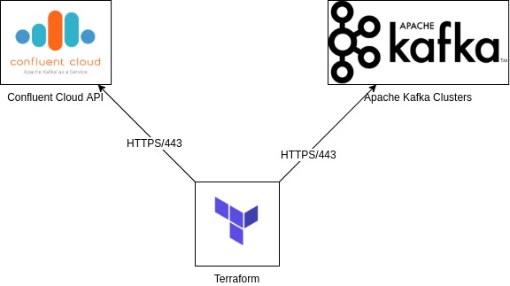

# Confluent Cloud Terraform Provider

This is a work in progress [Confluent Cloud](https://www.confluent.io/confluent-cloud/) [Terraform](https://www.terraform.io/) provider.

**This project is not yet production ready.**

## Status

This is only an initial commit. There are no releases at this time so you have to build this provider yourself.
The features available are only the minimum in order to us (Swan.io) to deploy our non-production environments with Terraform.

Besides, this provider is using a non public/documented API so it can break whenever.

Why publishing at this time if it not yet usable ?

* If it can help other peoples trying to do the same thing
* Have feedback

## Features

### Implemented

* Manage Kafka topics

### Todo (no specific order)

* Manage Kafka Clusters
* Manage API keys
* Add unit tests
* Add CI to create cross platform releases
* Add Datasource (Cluster/Topic/...)
* Write documentation
* [...]

## Network considerations

Terraform should be able to access:
* Confluent API (https://confluent.cloud):
  * Authentication
  * Cluster Management
  * API Keys  
* Kafka cluster:
  * Topics management
  


## How to deploy

At this time, there is no releases so you should be able to build this provider yourself (there are a lot of documentation on how to create a Terraform provider).
We hope to be able to create releases soon (in the TODO list).

## Examples

### Provider configuration

```hcl-terraform
provider "confluent" {
  email    = "xxxx" # Confluent cloud email
  password = "YYYY" # Confluent cloud password
}
```

You can also use the following environment variables

```shell script
$ export CONFLUENT_EMAIL=xxxx
$ export CONFLUENT_PASSWORD=YYYY
```
```hcl-terraform
provider "confluent" {  }
```

### Create a Kafka topic

```hcl-terraform
# Get Cluster
data "confluent_cluster" "cluster" {
  name = "kafka-cluster"
} 

resource "confluent_topic" "topic" {
  cluster_id     = confluent_cluster.cluster.id
  name           = "terraform"
  num_partitions = 3  
}
```

Available options are available in [resource_confluent_topic.go](resource_confluent_topic.go) (documentation not yet available).


